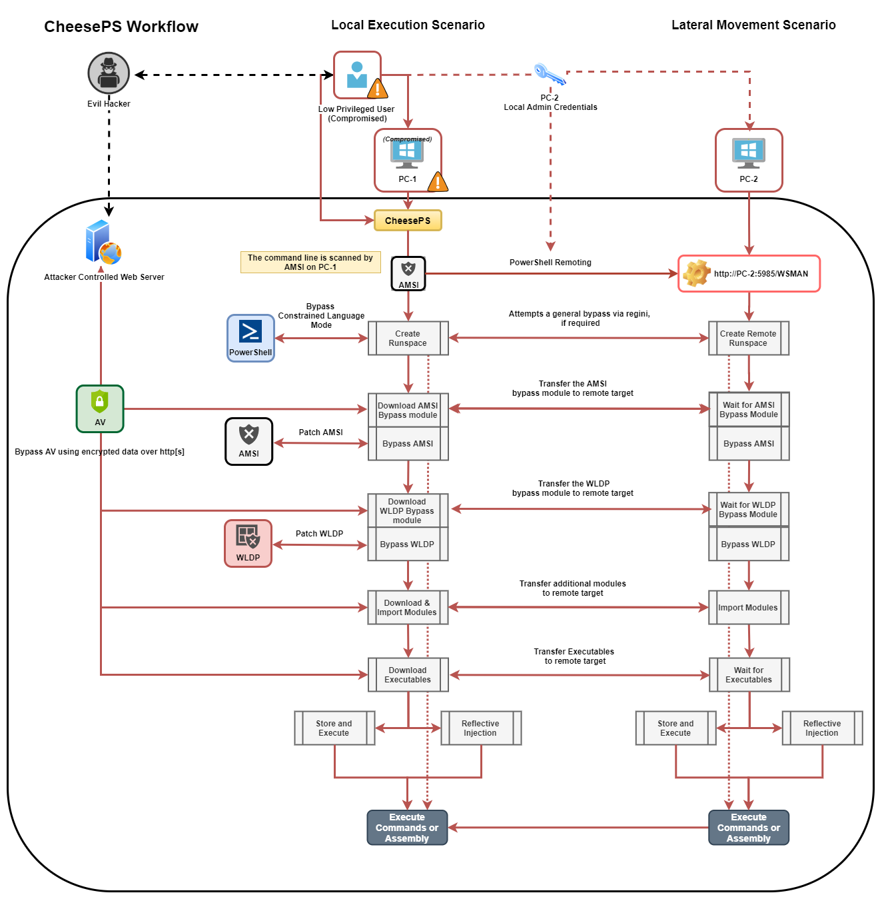

# CheeseTools

This repository has been made basing onto the already existing [MiscTool][1], so big shout-out to [rasta-mouse](https://twitter.com/rasta_mouse) for releasing them and for giving me the right motivation to work on them.

## CheeseExec
Command Exec / Lateral movement via PsExec-like functionality.  Must be running in the context of a privileged user.
The tool is based on [rasta-mouse](https://twitter.com/rasta_mouse) CsExec, but is designed to allow additional control over the service creation, specifically:
- Create (Search if the service exists, if not, tries to create it)
- Start (Search if the service exists and is stopped, if that's the case attempts to start it; if not, tries to create it and start it)
- Stop (Search if the service exists and is running, if that's the case attempts to stop it)
- Delete (Search if the service exists and is running, if that's the case attempts to stop it than delete it, otherwise it deletes it)
```
CheeseExec.exe <targetMachine> <serviceName> <binPath> <action>
```
Also see [TikiService][2].


## CheesePS
Cheese PS is Command Exec / Lateral Movement framework. It relies on `System.Management.Automation.PowerShell` to load and run arbitrary code via PowerShell. 
The tool is natively capable of bypassing common restrictions creating and using PowerShell runspaces on local or remote targets.
Must be running in the context of a privileged user (if using PowerShell Remoting).

The tool has been originally made as an enhancement of [rasta_mouse](https://twitter.com/rasta_mouse) CsPosh, but grew enough to become a framework on its own, and can now be used as a general PowerShell injector.

The idea behind this tool has been summarised in the following article:

* [CheesePS: Abusing the PowerShell Remoting for lateral Movement][5]

The main functionalities implemented are:
- BuiltIn CLM Bypass using REGINI
- BuiltIn AmsiBypass that patches Amsi before executing any other command
    + Permits to specify an alternate PowerShell script for AMSI bypass
- BuiltIn WldpBypass that patches WLDP before executing assemblies
    + Permits to specify an alternate PowerShell script for WLDP bypass
- Import modules and script before execution
    + Against a local target: modules are imported via filesystem, smb, or http[s]
    + Against a remote target: modules are loaded directly from the local machine using WS-Management
- Download binary and execute
    + Standard: Transfer -> Write to disk -> Execute
    + Reflective: Transfer -> Execute from memory
- Supports module/assemblies encryption (partial)
    + All imported Modules/Assemblies can be encrypted in transit or at rest, and are decrypted just before usage

The following screenshot is a decently accurate schema to describe the tool's workflow:



```
Usage:
Usage:
  -t, --target=VALUE         Target machine
  -c, --code=VALUE           Code to execute
  -e, --encoded              Indicates that provided code is base64 encoded
  -a, --am-si-bypass=VALUE   Uses the given PowerShell script to bypass A-M-S-
                               I (fs, smb o http[s])
      --aX, --encrypted-am-si
                             Indicates that provided A.M.S.I. bypass is
                               encrypted
  -i, --import=VALUE         Imports additional PowerShell modules (fs, smb o
                               http[s])
      --iX, --encrypted-imports
                             Indicates that provided PowerShell modules are
                               encrypted
  -o, --outstring            Append Out-String to code
  -r, --redirect             Redirect stderr to stdout
  -d, --domain=VALUE         Domain for alternate credentials
  -u, --username=VALUE       Username for alternate credentials
  -p, --password=VALUE       Password for alternate credentials
  -X, --encrypt=VALUE        Encrypt a script with an hardcoded key
  -D, --decrypt=VALUE        Test decryption of a script with an hardcoded key
  -n, --skip-bypass=VALUE    Skip A.M.S.I (A), WLDP (W) or ALL (*) Bypass
                               techniques
  -l, --lockdown-escape      Try to enable PowerShell FullLanguage mode using
                               REGINI
  -w, --wldp-bypass=VALUE    Uses the given PowerShell script to bypass WLDP
                               (fs, smb o http[s])
      --wx, --encrypted-wldp Indicates that provided WLDP bypass is encrypted
  -x, --executable=VALUE     [Download and] Execute given executable
      --xx, --encrypted-executable
                             Indicates that provided Exe/DLL is encrypted
      --xcs, --executable-csharp
                             Indicates that the executable provided is C# -
                               (.NET)
  -R, --reflective-injection Uses Invoke-ReflectivePEInjection to load the
                               assmebly from memory (requires Invoke-
                               ReflectivePEInjection to be imported!)
  -P, --powershell-decrypt   Force use of PowerShell-based decryption
  -k, --encryption-key=VALUE Uses the provided key for encryption/decryption
      --ssl                  Force use of SSL
  -h, -?, --help             Show Help
```

_Note: If executed without a target, the script will execute against the local machine_

Also see [AmsiBypass][3].


## CheeseDCOM
Command Exec / Lateral Movement via DCOM. Must be running in the context of a privileged user. 
This tool is based on [rasta-mouse](https://twitter.com/rasta_mouse) CsDCOM, but it's been improved to add additional methods, adapting to the new research made by Philip Tsukerman. 
There is also an experimental method to "fix" eventual attempts to disable affected DCOM objects via dcomcfg, but it requires some preconditions in order to work properly.

The idea behind this tool has been summarised in the following article:

* [CheeseDCOM: Abusing DCOM for lateral Movement][4]


Current Methods: `MMC20.Application`, `ShellWindows`, `ShellBrowserWindow`, `ExcelDDE`, `VisioAddonEx`,
                  `OutlookShellEx`, `ExcelXLL`, `VisioExecLine`, `OfficeMacro`.

```
Usage:
  -t, --target=VALUE         Target Machine
  -b, --binary=VALUE         Binary: powershell.exe
  -a, --args=VALUE           Arguments: -enc <blah>
  -m, --method=VALUE         Methods: MMC20Application, ShellWindows,
                               ShellBrowserWindow, ExcelDDE, VisioAddonEx,
                               OutlookShellEx, ExcelXLL, VisioExecLine, 
                               OfficeMacro
  -r, --reg, --registry      Enable registry manipulation
  -h, -?, --help             Show Help
```

_Note: If executed with `-t .`, the script will execute against the local machine_

Also see [Lateral Movement Using DCOM Objects and C#][4]

## Credits
- [MiscTool][1] by [rasta-mouse](https://github.com/rasta-mouse)
- [AmsiBypass][6] by [0xB455](https://github.com/0xB455)


## References

[1]: https://github.com/rasta-mouse/MiscTools
[2]: https://rastamouse.me/2018/10/amsiscanbuffer-bypass---part-1/
[3]: https://rastamouse.me/2019/08/tikiservice/
[4]: https://klezvirus.github.io/RedTeaming/LateralMovement/LateralMovementDCOM/
[5]: https://klezvirus.github.io/RedTeaming/LateralMovement/LateralMovementPSRemoting/
[6]: https://github.com/0xB455/AmsiBypass
